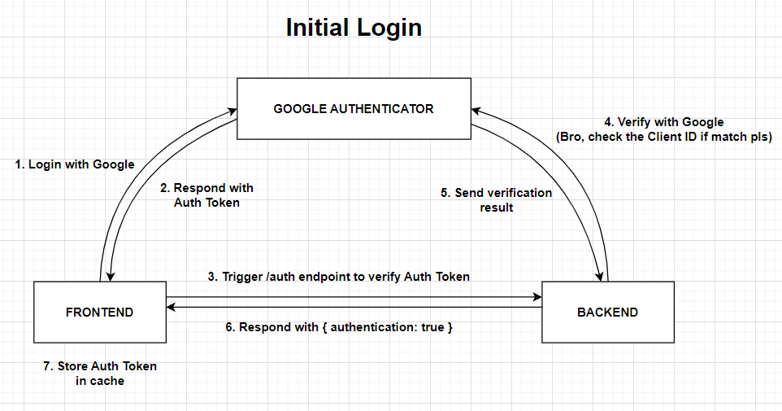
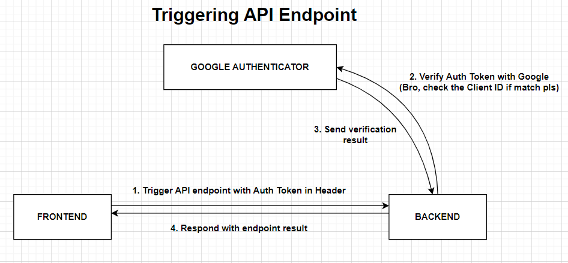
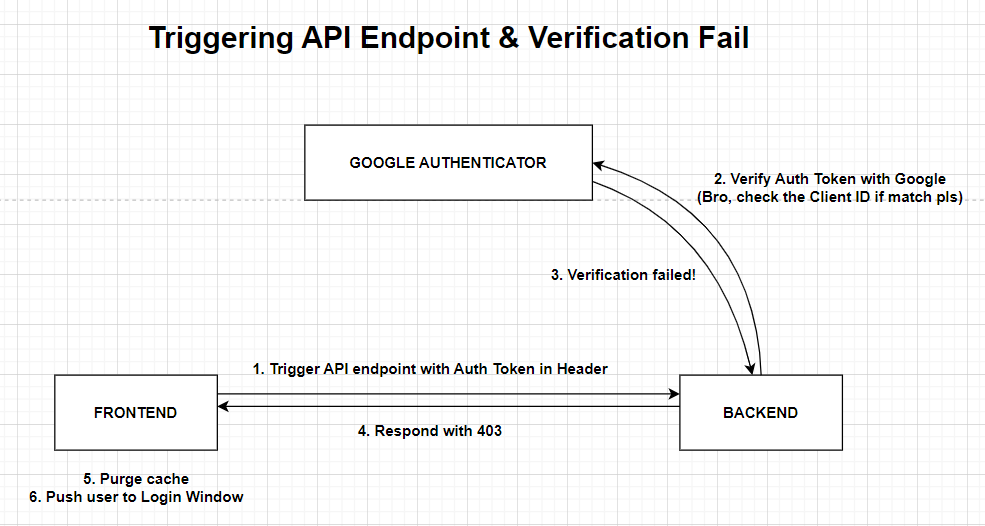
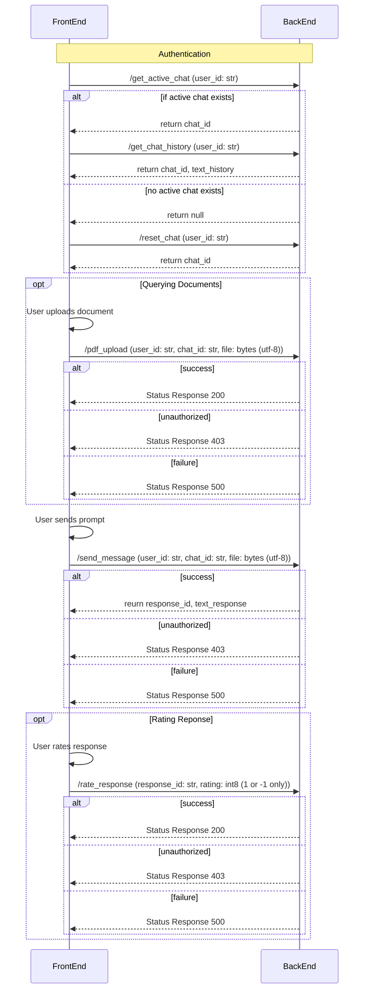

# llm-frontend
AIDE, the invaluable companion to defense engineers, accelerates projects by providing instant expertise, technical insights, and precise problem-solving. With a deep understanding of defense technology and processes, AIDE empowers engineers to navigate complexities effortlessly, enabling them to innovate and contribute to the defense industry's continued progress with confidence and precision.

### Authentication




### Sequence diagram
This is a sample sequence of events to understand the function of the frontend service.

#### Chat


## Build

To build the docker container, run
```bash
docker build . -t llm-frontend:latest
```

## Run Locally
Configure the `.env` file as follow:
```
BACKEND_HOST= # localhost
VITE_API_BASE= # http://${BACKEND_HOST}:3001/api
NODE_ENV= # development | production
```

To run the Docker container and serve the Node application:
```sh
docker run -d -p 3000:3000 llm-frontend:latest npx vite serve
```


## API Gateways
| Endpoint | Request Type | Required Fields | Return |
| - | - | - | - |
| /auth | `GET` | * | sess_id: ``str`` |
| /reset_chat | `GET` | user_id: `str` | chat_id: `str` |
| /pdf_upload | `POST` | user_id: `str`<br>chat_id: `str`<br>file: `bytes` (utf-8) | - |
| /send_message | `POST` | user_id: `str`<br>chat_Id: `str`<br>text: `str` | response_id: `str`<br>text_response: `str` |
| /rate_response | `POST` | response_Id: `str`<br>rating: `int8` (1 or -1 only) | - |
| /get_chat_history | `GET` | user_id: `str` | chat_id: `str`<br>text_history: `List[{`<br>&nbsp;`response_id: str`<br>&nbsp;`text_response: str`<br>`}]`
| /get_active_chat | `GET` | user_id: `str` | chat_id:`str` or `null` |
